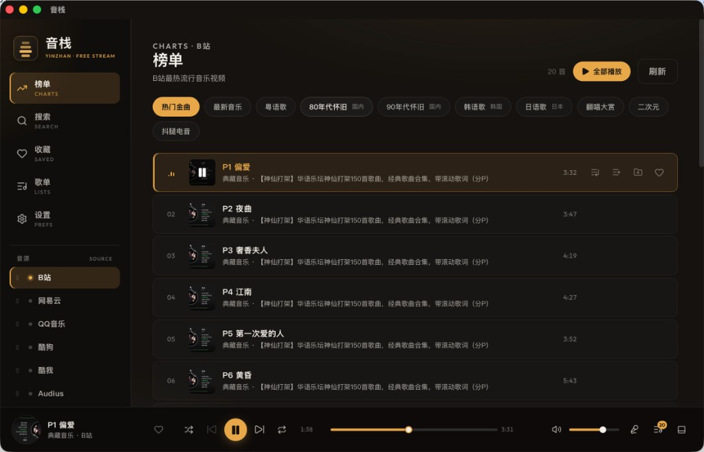
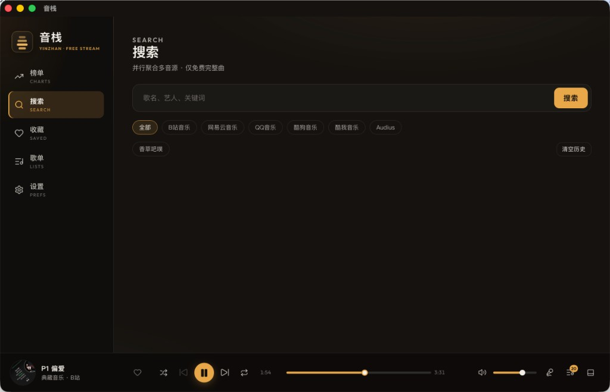
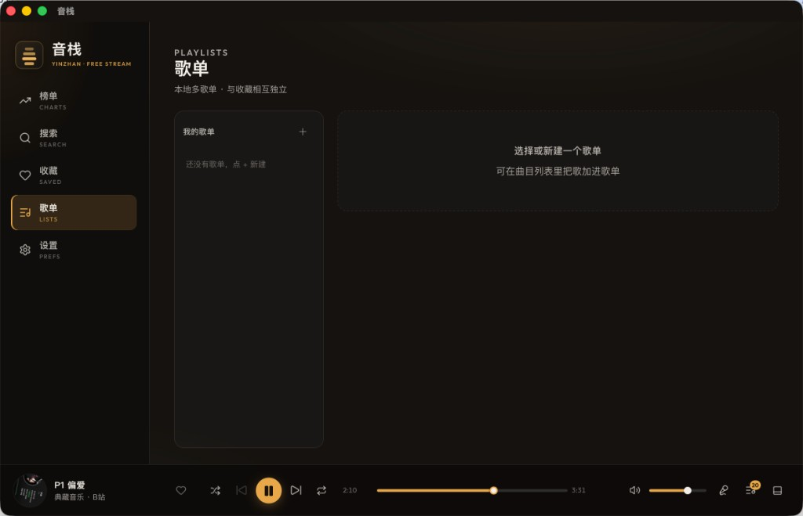
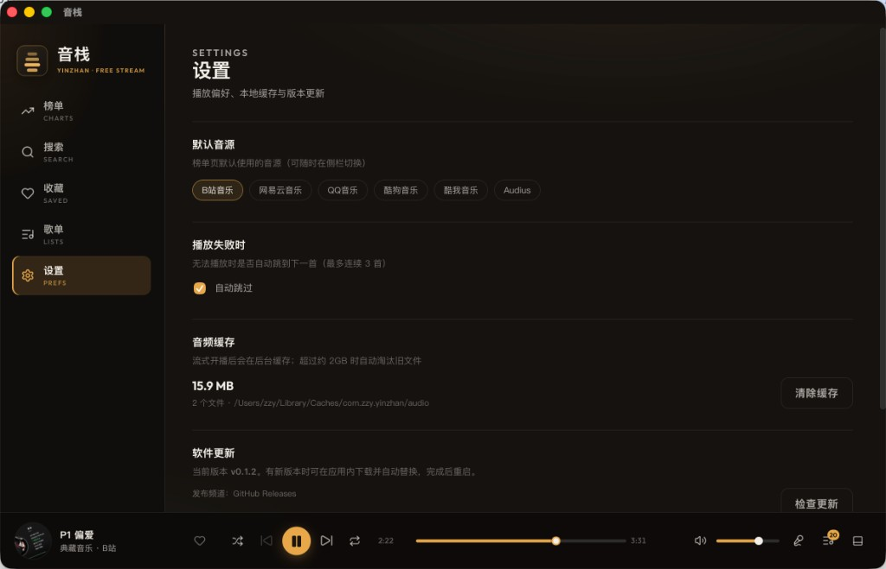

# 音栈 · YinZhan

桌面端多音源音乐客户端。聚合网易云、QQ 音乐、哔哩哔哩、酷狗、酷我，以及 **Audius**（开放音源、免登录）等平台的**可免费完整播放**曲目，在本地完成榜单浏览、搜索、收藏、歌单与播放，无需登录、无需自建服务端。

[](https://github.com/kivenZhou/free-music/releases)
[](./LICENSE)
[](https://github.com/kivenZhou/free-music/releases)

---

## 概述

音栈将分散在各平台的免费可播内容收敛到同一套桌面体验中：侧栏切换音源，播放器、队列、歌词与本地库统一管理。数据全部保存在本机，不提供账号体系与社交功能。

| 项目 | 说明 |
|------|------|
| 支持平台 | macOS（Intel / Apple Silicon）、Windows x64 |
| 当前版本 | [v0.2.2](https://github.com/kivenZhou/free-music/releases/tag/v0.2.2) |
| 许可证 | [MIT](./LICENSE) |
| 发行页 | [GitHub Releases](https://github.com/kivenZhou/free-music/releases) |

> **定位**：本项目是面向学习与个人使用的桌面客户端，仅请求各站**已对外可访问**的免费完整流；不破解会员、不绕过版权保护、不提供账号登录代充，也不自建或分发音源文件。会员专属、下架或试听截断内容无法播放——结果完全取决于源站策略。请遵守各平台服务条款与当地法律；本项目与各音源平台无隶属或授权关系。

---

## 界面预览

<p align="center">
  
</p>

<p align="center">
  
  &nbsp;
  
</p>

<p align="center">
  
</p>

| 榜单 | 搜索 | 歌单 | 设置 |
|------|------|------|------|
| 多音源分类浏览与播放 | 聚合搜索、按音源筛选 | 本地多歌单管理 | 默认音源、语音助手、缓存与更新 |

---

## 功能

- **多音源切换** — 榜单与搜索按音源独立浏览，共用同一播放器（含 Audius 开放音源）
- **完整曲过滤** — 优先展示可完整播放的曲目，减少点播失败
- **本地媒体库** — 收藏、多歌单、搜索历史、播放队列均持久化在本机
- **播放体验** — 队列 / 循环 / 随机、歌词、迷你窗、系统媒体键、菜单栏托盘
- **智能语音助手（macOS）** — 说「小栈小栈」唤醒；播控、点播、歌词、收藏、切源与主题歌单等
- **轻量架构** — 基于 Tauri 2，相对 Electron 体积与内存占用更小

| 模块 | 说明 |
|------|------|
| 榜单 | 各音源热歌、新歌等分类；支持分页加载 |
| 搜索 | 可按音源筛选；搜索历史保存在搜索页，可单条或批量清除 |
| 收藏 / 歌单 | 多歌单管理，曲目可加入指定歌单 |
| 播放 | 应用内播放；部分音源支持流式开播与后台缓存 |
| 歌词 | 本源优先（网易云 / QQ / 酷狗 / 酷我）；否则清洗歌名后跨匹配网易云；再失败用 [LRCLIB](https://lrclib.net) 兜底 |
| 语音助手 | macOS 打包版可用；设置中开启。唤醒词「小栈小栈」。点播顺序：播放列表 → 收藏 → 当前默认音源搜索首条；回复优先微软晓晓神经语音 |
| 设置 | 默认音源、语音助手、自动跳过、缓存清理与软件更新等 |

---

## 安装

请从 [Releases](https://github.com/kivenZhou/free-music/releases) 下载对应平台安装包。

| 平台 | 文件 |
|------|------|
| macOS（通用） | `YinZhan_*_macos_universal.dmg` 或 `.zip` |
| Windows x64 | `YinZhan_*_windows_x64-setup.exe` |

### macOS

1. 打开 `.dmg`，将应用拖入「应用程序」；或解压 `.zip` 后移动到「应用程序」。
2. 首次启动：对应用图标**右键 → 打开**，在系统提示中确认「打开」。

因未进行 Apple 公证，经微信等即时通讯转发的安装包可能被标记为「已损坏」。建议通过浏览器、隔空投送或网盘获取，必要时在终端执行：

```bash
xattr -cr /Applications/音栈.app
```

完成后再次右键打开即可。

### Windows

1. 下载完整的 `YinZhan_*_windows_x64-setup.exe`（勿用微信直接转发；建议浏览器或网盘）。
2. 双击安装。若出现 SmartScreen「已阻止」，点「更多信息」→「仍要运行」（开源未签名包的常见情况）。
3. 安装程序为**当前用户**安装，一般不需要管理员权限。
4. 若安装后无法启动，请先安装 [WebView2 运行时](https://developer.microsoft.com/microsoft-edge/webview2/)（Edge 用户通常已自带）。

---

## 数据位置

| 内容 | macOS | Windows |
|------|-------|---------|
| 搜索历史、收藏、歌单 | `~/Library/Application Support/com.zzy.yinzhan/` | `%APPDATA%\com.zzy.yinzhan\` |
| 音频缓存 | `~/Library/Caches/com.zzy.yinzhan/audio/` | `%LOCALAPPDATA%\com.zzy.yinzhan\` |

可在应用「设置」中清除音频缓存。

---

## 从源码构建

### 环境要求

- Node.js 18+
- Rust（推荐通过 [rustup](https://rustup.rs) 安装）
- macOS：Xcode Command Line Tools

### 开发运行

```bash
git clone https://github.com/kivenZhou/free-music.git
cd free-music
npm install
npm run tauri dev
```

修改 Rust 代码或 Tauri `capabilities` 后，需完整重启开发进程。

### 发布构建

```bash
# macOS 通用二进制
npm run tauri build -- --target universal-apple-darwin

# Windows（请在 Windows 环境执行，或使用仓库 Actions）
npm run tauri build
```

推送版本标签（例如 `v0.2.0`）或手动触发 `.github/workflows/release.yml`，可自动构建 macOS / Windows 发行产物。

### 应用内更新

正式包启动后会检查 [GitHub Releases](https://github.com/kivenZhou/free-music/releases) 是否有新版本；也可在「设置 → 软件更新」中手动检查。确认后将下载更新包、校验签名、替换安装并重启。

发布带签名的更新产物需要配置仓库 Secrets：

| Secret | 说明 |
|--------|------|
| `TAURI_SIGNING_PRIVATE_KEY` | 更新签名私钥全文（本地生成后保存在 `.tauri/yinzhan.key`，勿提交仓库） |
| `TAURI_SIGNING_PRIVATE_KEY_PASSWORD` | 私钥密码；无密码时可留空 |

本地首次生成密钥（仅需一次）：

```bash
npx tauri signer generate --ci -w .tauri/yinzhan.key
```

将 `.tauri/yinzhan.key` 内容写入 `TAURI_SIGNING_PRIVATE_KEY`。公钥已写入 `src-tauri/tauri.conf.json`，丢失私钥将无法继续为已安装用户签发更新。

本地打包时同样需要导出私钥，否则无法生成 updater 产物：

```bash
export TAURI_SIGNING_PRIVATE_KEY="$(cat .tauri/yinzhan.key)"
npm run tauri build
```

---

## 技术栈

| 层级 | 技术 |
|------|------|
| 界面 | React 19、Vite、TypeScript |
| 桌面壳 | Tauri 2 |
| 本地存储 | SQLite |
| 音源接入 | Rust Provider（可插拔） |
| 语音（macOS） | SFSpeechRecognizer + 本地意图规则 / 小型 n-gram 模型；TTS 优先 Edge 神经语音 |

---

## 免责声明

1. **使用范围**  
   本软件按「现状」提供，仅供学习、研究与个人非商业使用。下载、安装与使用即表示你理解并自行承担相应风险。

2. **内容与版权**  
   音栈不拥有、不托管、不分发音乐作品。播放地址来自第三方平台当时可访问的公开接口或页面能力；著作权及其他权利仍归原权利人及平台所有。本项目**不提供**破解会员、绕过 DRM / 版权保护、批量镜像曲库或其他违法用途。

3. **平台关系**  
   本项目为独立开源作品，与网易云、QQ 音乐、哔哩哔哩、酷狗、酷我、Audius 等平台**无官方合作、授权或隶属关系**。Audius 曲目多为艺人自行上传分发；咪咕、Openverse、Internet Archive、YouTube 等源因接口关闭或国内网络不可达，暂不默认接入。请遵守各平台服务条款；若平台调整接口、限制访问或要求停止使用某能力，相关功能可能随时失效，届时应停止继续使用该音源。

4. **可用性**  
   第三方接口可能变更、限流或失效；榜单为空、无法播放、缓存异常等情况属预期风险。本地音频缓存仅便于个人回放，可随时在设置中清除，不应被理解为可再分发的曲库。

5. **责任限制**  
   在适用法律允许的最大范围内，作者与贡献者不对因使用、无法使用或依赖本软件而产生的任何直接或间接损失承担责任。若你所在地区的法律不允许此类限制，请勿使用本软件。

---

## License

本项目基于 [MIT License](./LICENSE) 开源。
